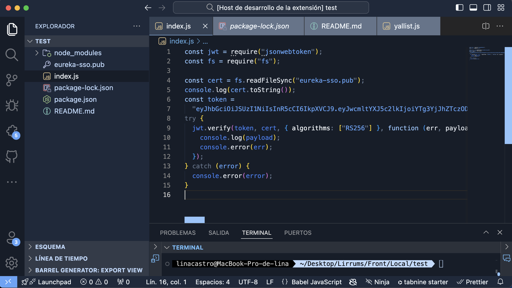

A _Superminimal_, _dark_ Color Theme. This is the first major version of the **Lubuntu** theme. It's a _dark_ syntax theme crafted especially for [Visual Studio Code](https://code.visualstudio.com) [New Version], with subtle colors that are meant to be easy on the eyes and is a huge quick win if you like Lubuntu linux distribution.
---
)

> This is a screenshot as example of a code editor with some customs, is based in a MACBOOK OS, it can change if you use a Linux OS.
---

## ⌨️ Installation

Preferences:

1. Go to `Extensions`
2. Go to `Color Themes` and choose `Lubuntu theme` as the color theme or `CMD + Shift + P` and enter Command `> color theme` and choose `Lubuntu theme`.

## 唥 Language support

Lubuntu Color Theme Supported and optimized for many languages:

-   _Markup:_ `HTML`, `MarkDown(.md)`, `jsdoc`.
-   _CSS:_ `Sass`, `SCSS`, `LESS`.
-   _JavaScript:_ `JS`, `ES6`, `JSX`, `CoffeeScript`.
---

## 🐛 Issues and contributing

If you would like to create a new Issue or PR, please do so in:

-   This repo if it's about color changes, first read [Color Semantics](https://github.com/tinkertrain/panda-syntax-vscode/blob/master/Color%20Semantics.md) and Change `themes` files.
